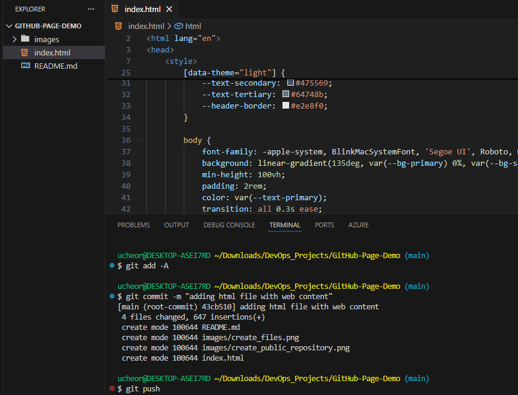
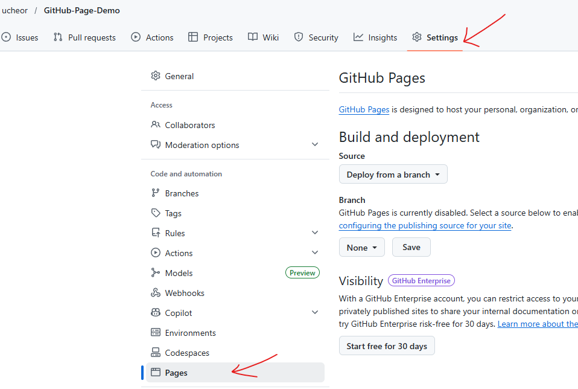
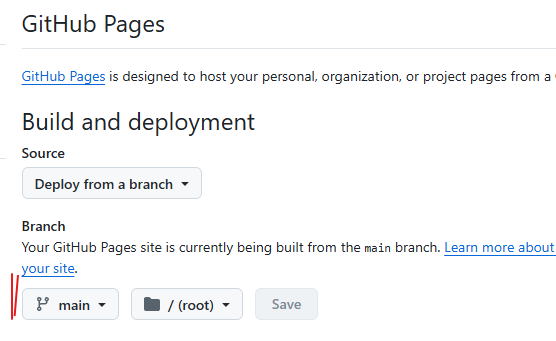
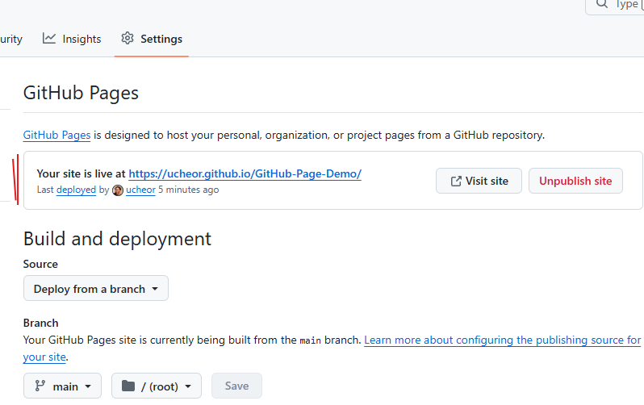

# GitHub Pages Demo

A clean, responsive starter template and demonstration of **GitHub Pages** deployment.

**🔗 [View Live Demo**](https://ucheor.github.io/GitHub-Page-Demo/)

---

## 📖 About This Project

This repository serves as a live example of how to host a static website directly from a GitHub repository. It is built using standard web technologies and is intended to show how easy it is to bridge the gap between code and a live URL.

### Key Features:

* **Auto-Deployment:** Uses GitHub Actions/Pages to update the site instantly on every push.
* **Responsive Design:** Optimized for mobile, tablet, and desktop views.
* **Lightweight:** Zero dependencies; built with pure HTML, CSS, and JavaScript.

---

## 🚀 Launch Your Own Version

If you want to use this demo as a template for your own site:

1. **Create a repository** on your GitHub account. Add an index.html file with your code to the repository.
2. Go to the **Settings** tab of your repo.
3. In the left sidebar, click **Pages**.
4. Under **Build and deployment**, ensure the source is set to "Deploy from a branch" and select `main`.
5. Wait about 60 seconds, and your site will be live at `https://<your-username>.github.io/<Repo-Name>/`!
---



---


---


---


---


---


---

## 📂 Project Structure

```text
.
├── index.html   # Your live website
└── README.md    # Your GitHub project documentation

```

## 🛠️ How it was Built

1. **HTML5/CSS3:** Structured for semantic SEO and styled with modern CSS (Flexbox/Grid).
2. **GitHub Pages:** Configured via the repository settings to serve content from the `main` branch.
3. **Custom Domain Ready:** Though currently using the `*.github.io` suffix, this structure is ready for a custom CNAME.

---

**Built with ❤️ by [ucheor**](https://www.google.com/search?q=https://github.com/ucheor)
